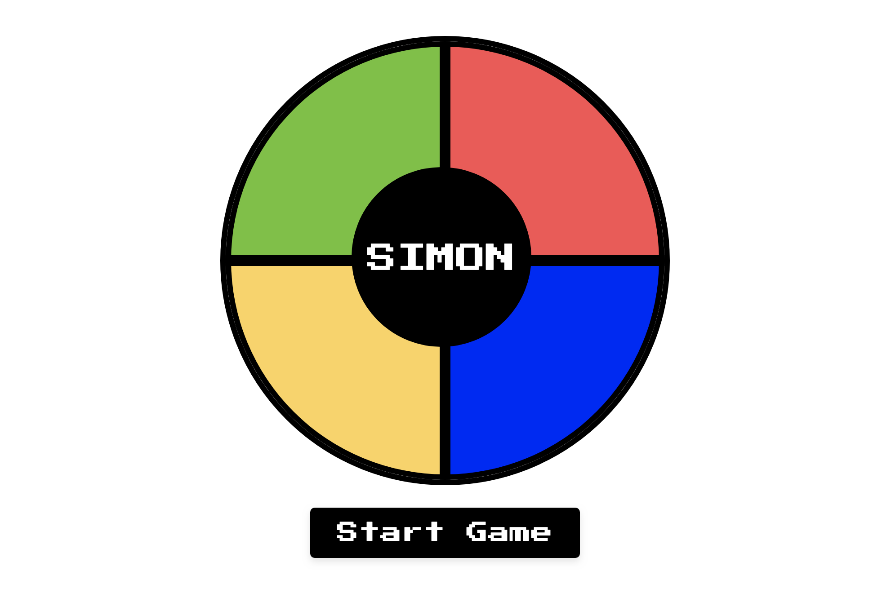

# Simon Game

Welcome to the Simon Game repository! This project is a web-based implementation of the classic Simon Game using HTML, CSS, and JavaScript.

## Features

- Classic Simon Game experience with a modern twist.
- Challenge your memory by repeating sequences of colors.
- Enjoy sound effects and animations to enhance gameplay.
- Track your highest score and strive to beat it.

## How to Play
1. Visit [My Website](https://jlee0310.github.io/simonGame/) or Clone the repository.
2. Click the "Start" button to initiate the game.
3. Observe the sequence of colors displayed.
4. Repeat the sequence by clicking the colored buttons in the correct order.
5. If you succeed, the game will progress to the next level with a longer sequence.
6. If you make a mistake, the game will end, and your highest score will be displayed.

## Technologies Used
- HTML
- CSS
- JavaScript

## Acknowledgments
- Sounds from freesound.org
- Icons from FontAwesome
- Background pattern from Subtle Patterns
